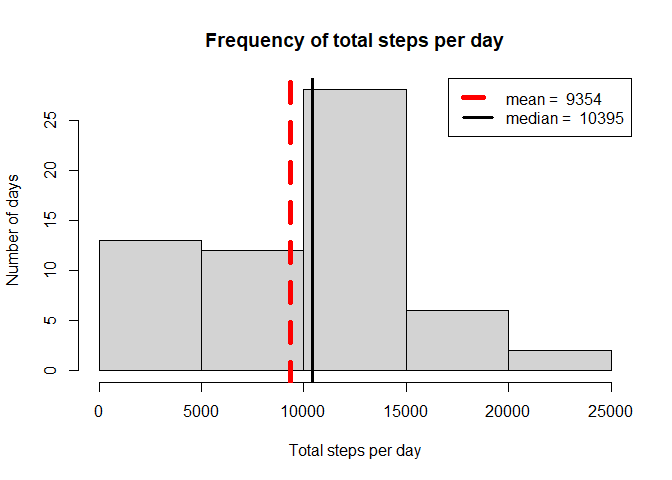
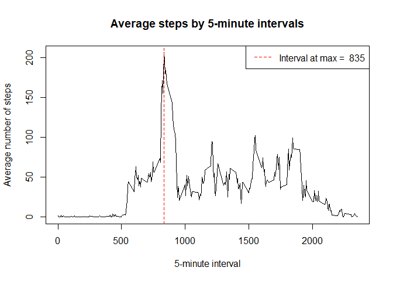
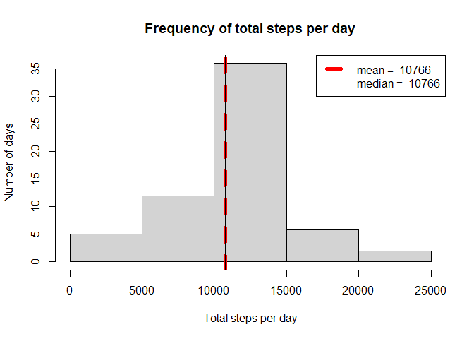
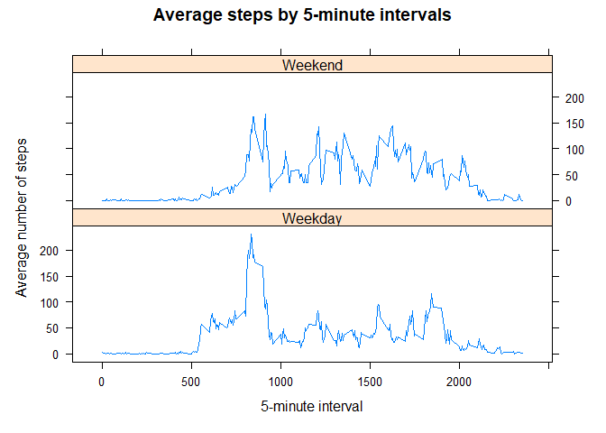

## Loading and preprocessing the data

This section contains the code for loading the assignment data into R.


```r
library(dplyr)
library(lattice)
options(scipen=999)

#Download file if not already in the working directory

file_URL <- "https://d396qusza40orc.cloudfront.net/repdata%2Fdata%2Factivity.zip"

if (!file.exists("activity.zip")) {
	download.file(file_URL, destfile = "activity.zip", method = "curl")
}

#Unzip the file if the .csv file is not already present

if (!file.exists("activity.csv")) {
	unzip(zipfile = "activity.zip")
}

#Load the data from the .csv file

activity_data <- read.csv("activity.csv", header = TRUE)
```


## What is mean total number of steps taken per day?


```r
#Create a data frame with the total number of steps taken per day while ignoring missing values

df_total <- activity_data %>%
          group_by(date) %>%
          summarize(steps = sum(steps, na.rm = TRUE))

#Calculate mean and median number of steps

mean_steps <- round(mean(df_total$steps, na.rm = TRUE))
median_steps<- median(df_total$steps, na.rm = TRUE)

#Create a histogram of the total number of steps each day and add a vertical line for mean and median

hist(df_total$steps, xlab = "Total steps per day", ylab = "Number of days", main = "Frequency of total steps per day")
abline(v= mean_steps, lwd =5, lty = 2, col = "red")
abline(v= median_steps, lwd =3, lty = 1, col = "black")
legend("topright", legend = c(paste("mean = ", mean_steps), paste("median = ", median_steps)), lwd = c(5,3), lty = c(2,1), col = c("red","black"))
```

<!-- -->

The mean number of steps taken per day is 9354. The median is 10395.


## What is the average daily activity pattern?


```r
#Create a data frame with the average number of steps per 5-minute interval across all days

df_average <- activity_data %>%
         group_by(interval) %>%
         summarize(steps = mean(steps, na.rm = TRUE))

#Calculate the interval with the highest average number of steps
max_interval <- df_average$interval[df_average$steps == max(df_average$steps)]

#Create a plot of the average number of steps for each interval

plot(df_average$interval, df_average$steps, type = "l", xlab = "5-minute interval", ylab = "Average number of steps", main = "Average steps by 5-minute intervals")
abline(v= max_interval, lwd =1, lty = 2, col = "red")
legend("topright", legend = paste("Interval at max = ", max_interval), lwd = 1, lty = 2, col = "red")
```

<!-- -->

The interval which contains the maximum number of steps averaged across all days is 835.

## Imputing missing values


```r
#Calculate the total number of missing values

missing_values <- sum(is.na(activity_data$steps))

#Replace the missing values with the mean for that 5-minute interval across all days.

df_missing <- activity_data %>%
            group_by(interval) %>%
            mutate(steps = replace(steps, is.na(steps) ,mean(steps, na.rm = TRUE)))

#Create a data frame with the total number of steps taken per day and missing data filled in.

df_missing_total <- df_missing %>%
            group_by(date) %>%
            summarize(steps = sum(steps))

#Calculate mean and median number of steps

mean_steps <- round(mean(df_missing_total$steps, na.rm = TRUE))
median_steps<- round(median(df_missing_total$steps, na.rm = TRUE))


#Create a histogram of the total number of steps each day and add a vertical line for mean and median

hist(df_missing_total$steps, xlab = "Total steps per day", ylab = "Number of days", main = "Frequency of total steps per day")
abline(v= mean_steps, lwd =5, lty = 2, col = "red")
abline(v= median_steps, lwd =1, lty = 1, col = "black")
legend("topright", legend = c(paste("mean = ", mean_steps), paste("median = ", median_steps)), lwd = c(5,1), lty = c(2,1), col = c("red","black"))
```

<!-- -->

The dataset contains 2304 missing values. In this section the missing values have been replaced with the mean of the respective 5-minute interval across all days. The mean is now 10766 and the median is 10766. There is quite a significant change from the first part of the assignment. The two values are now the same.


## Are there differences in activity patterns between weekdays and weekends?


```r
#Create a variable weekday that stores the names of the days and based on that create another variable that identifies the days as either weekend or weekday.

df_weekdays <- df_missing %>%
             mutate(weekday = weekdays(as.Date(date))) %>%
             mutate(weekday_type = if_else(weekday == "Saturday" | weekday == "Sunday", "Weekend" , "Weekday"))

#Create a data frame with the average number of steps per 5-minute interval and group by weekend and weekday.

df_weekdays_average <- df_weekdays %>%
          group_by(interval, weekday_type) %>%
          summarize(steps = mean(steps, na.rm = TRUE))

#Using lattice, create a panel plot of the average number of steps per interval for the two categories

xyplot(steps ~ interval | weekday_type, data = df_weekdays_average, type = "l", layout = c(1,2), xlab = "5-minute interval", ylab = "Average number of steps", main = "Average steps by 5-minute intervals")
```

<!-- -->

According to the plot, there is a difference in the patterns between weekdays and weekends. On weekdays, the activity starts earlier and has a higher spike in the first half of the day, but then it decreases more for the rest of the day. In weekends, activity starts later but maintains at a higher level for the entire day.

